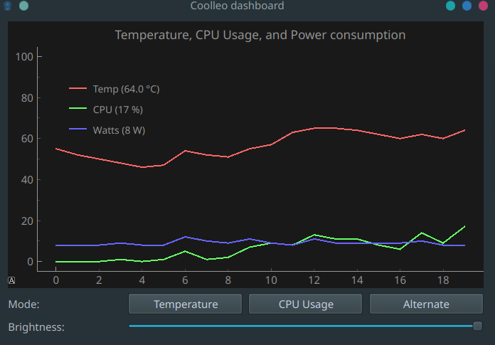

# Coolleo B40S DIG Linux Driver

Graphical controller and real-time backend for the Coolleo B40S DIG cooler.

## Tested on

- B40S DIG BK ARGB

## MAYBE compatible with (NOT TESTED)

- B40S DIG ARGB
- CL-B40-DIG
- CL-B40-DIG-ARGB
- CL-B40-DIG-BK
- CL-B40-DIG-BK-ARGB
- CL-B40S-DIG
- CL-B40S-DIG-ARGB
- CL-B40S-DIG-BK
- CL-B40S-DIG-BK-ARGB
- CL-B60-DIG V2
- CL-B60-DIG-ARGB V2
- CL-B60-DIG-BK V2
- CL-B60-DIG-BK-ARGB V2
- Etian CL-P50i-DIG
- Etian CL-P50i-DIG-ARGB
- P60T DIG
- P60T DIG BK

If you can give me some feedback on how any of these devices work, that would be great!

## Tech Stack

**Python** 3.11

**GUI:** PyQt6 + PyqtGraph

**Backend:** PySerial 

**Aux  Libraries** [lm_sensors](https://github.com/lm-sensors/lm-sensors)
## Environment Variables

You have an example env file with the necessary variables. Just copy and rename it

## Contributing

This is a personal project. Feel free to fork and contribute!

## License

[MIT](https://choosealicense.com/licenses/mit/)
## Screenshots

